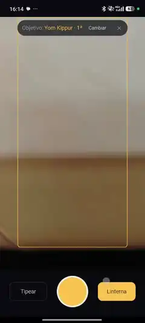

# NavTorah

Find your place in a Sefer Torah with your phone. Point the camera at the open column and NavTorah tells you the book, parashah, aliyah and verses, and how many columns to move to reach the reading you want. When it isn't sure, it says so instead of guessing.

The app is available in English and Spanish.

## Demo

Two real tests, recorded with an earlier, Spanish-only version of the app. The previews play at 3x; click one for the full video.

| A worn sefer | A printed tikkun |
|---|---|
| [](apps/web/public/demo/worn-sefer.mp4) | [](apps/web/public/demo/printed-tikkun.mp4) |
| Target: the first aliyah of Yom Kippur. The scroll is open at Acharei Mot, column 132, and the app says 1 column to the right. | Target: the maftir of Rosh Hashanah. The book is open at Balak, column 181, and the app says 9 columns to the left. |

## How it works

NavTorah doesn't recognize the image; it locates text. First the column is transcribed, errors and all. A matcher then finds that transcription in the full Torah text (80,316 words) using diagonal voting and banded alignment, with an edit distance that treats common STA"M letter confusions (ב/כ, ד/ר, ה/ח/ת…) as cheap.

The matcher decides, not the model. Confidence comes from the margin between the best and second-best candidate. Repeated passages, like the offerings of the nesiim in Bamidbar 7, come back as ambiguous with both candidates.

Positions are word indexes, so any layout works. On scrolls with the standard 245-column, 42-line layout it also gives the exact column and line.

### Reading on the phone

By default the phone reads the photo itself, with no API and no cost, and sends only the text. Classical image processing (`packages/vision`) flattens the lighting, finds the column between its blank margins and follows each line across it, through tilt and curvature. A small neural network (a CRNN of 0.45M parameters, run with ONNX Runtime Web) then reads each line. It reads worse than a large vision model, but the matcher doesn't need a perfect reading: letters the network is unsure of come out as `?`, which the matcher treats as a wildcard, so it still places the column or says it can't.

The network was trained on synthetic photos of real columns in STA"M fonts, aged and photographed in software; see [tools/train](tools/train/README.md). When the local reading isn't enough, the app offers to send that same photo to Claude.

## Navigation

Pick a target: the reading for a date, a holiday or special day, a parashah and aliyah, or a verse. The calendar comes from [hebcal](https://github.com/hebcal) and handles each year's variants: Rosh Hashanah on Shabbat, chol hamoed, fast days, Rosh Chodesh, and special Shabbatot with a maftir from a second sefer.

After each scan NavTorah says how many columns to move and which way. The count is exact on standard-layout scrolls and estimated on others, getting better with each scan. Once you're there, it tells you the line and the first words. Instructions can be read aloud.

## Running it

Requires Node 22+ and pnpm.

```bash
pnpm install
pnpm test
```

The local reader needs no configuration. To also offer the Claude models, copy `apps/web/.env.example` to `apps/web/.env.local` and set `ANTHROPIC_API_KEY`. To try the Claude path of the UI without a key, use the oracle provider, which returns the real text of a column with simulated OCR noise:

```bash
OCR_PROVIDER=oracle OCR_ORACLE_COLUMN=50 pnpm --filter @navtora/web dev:http
```

The camera only works in a secure context. To test from a phone on the same network, `pnpm dev` runs Next.js with local HTTPS.

The site has a public landing page at `/en` and `/es`; the app itself is at `/en/app` and `/es/app`. If you host a copy, set `ADMIN_PASSWORD` to require a password for the app and its API, so strangers can't spend your API credits. Without it, the app is open.

A local scan takes a second or two and costs nothing. With Claude (Opus 5, effort low, 14 lines) a scan takes about 15 seconds and costs about 3 US cents; `OCR_MODEL=claude-sonnet-5` brings it to about 1 cent with similar accuracy on clean scrolls.

## Repository layout

| Path | What it does |
|---|---|
| `packages/core` | The engine, in plain TypeScript: normalization, index, STA"M-aware distance, matcher, navigation. |
| `packages/data` | Torah text, the standard 245-column layout, and parashot with aliyot, built from tikkun.io. |
| `packages/vision` | Image processing for the local reader: lighting, column and line detection, line crops. No dependencies. |
| `packages/ocr` | OCR providers: local (vision + CRNN, with the model runner injected), Claude vision, an oracle for testing without a key, and a disk cache for evaluation. |
| `apps/web` | The Next.js PWA: camera, results, navigation, target picker, manual entry. |
| `tools/eval` | Evaluation on openly licensed scanned sifrei, on simulated noise, and of the local reader. |
| `tools/train` | Synthetic training data and training of the local reader. |

`packages/data/dist` is committed. `pnpm build:data` regenerates it from `packages/data/raw`.

## Evaluation

On a scanned standard-layout sefer with known positions, every column was placed correctly. On three older or non-standard scrolls, one of them from the 15th century, every confident answer was consistent with the neighboring columns, and the app abstained on crops without readable text. With up to 50% of letters wrong in simulated OCR output, the matcher never placed a passage wrongly with confidence. Details and how to reproduce them are in [docs/evaluation.md](docs/evaluation.md).

It has also been used on a worn sefer and on a printed tikkun; see the [demo](#demo).

The local reader, trained only on synthetic photos, placed 241 of the 246 columns of the Shannon sefer, all with the exact column number (the rest are the nesiim and the two songs in brick layout), 225 of 226 of the Kokhav sefer, 189 of 190 of Makhon Ot and 187 of 233 British Library crops, with no wrong or out-of-order answer. It also placed all 10 real frames from the two recordings.

## Privacy

With the local reader, the photo never leaves the phone: only the transcribed text goes to the server. A photo is sent only when you choose a Claude model, or ask Claude for a second opinion; then it goes to the server and to the Anthropic API for transcription. NavTorah never stores images. The server logs only timings, token counts and the result status.

## License

The code is [MIT](LICENSE).

- The Torah text and standard layout come from [tikkun.io](https://github.com/akivajgordon/tikkun.io) (MIT). See [packages/data/NOTICE.md](packages/data/NOTICE.md).
- The local reader runs on [ONNX Runtime Web](https://github.com/microsoft/onnxruntime) (MIT). Its training images are rendered with the [Culmus](https://culmus.sourceforge.io) fonts (GPL-2.0 with a font exception); the fonts are not distributed here.
- The web app uses `@hebcal/core` (GPL-2.0) and `@hebcal/leyning` (BSD-2-Clause) for the reading calendar. If you distribute a build of `apps/web`, the GPL applies to that combined work.
- The scans used for evaluation are not in this repository. `tools/eval/src/download.ts` lists their sources and licenses.
